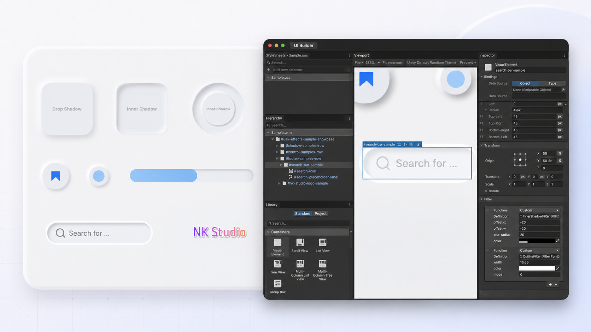
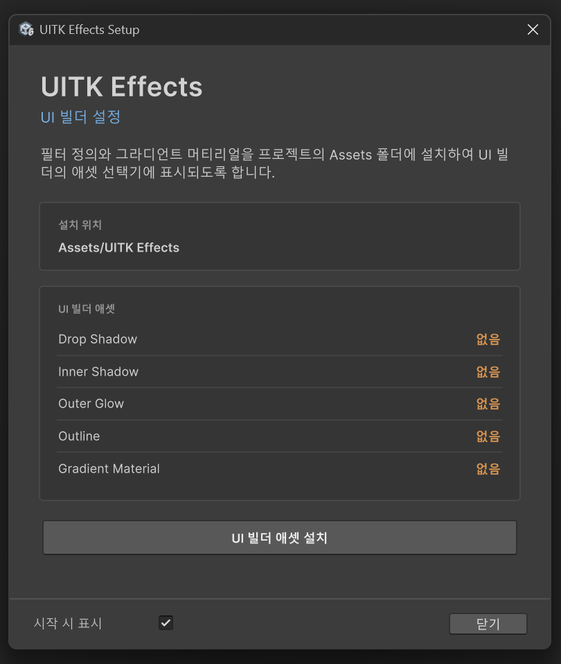
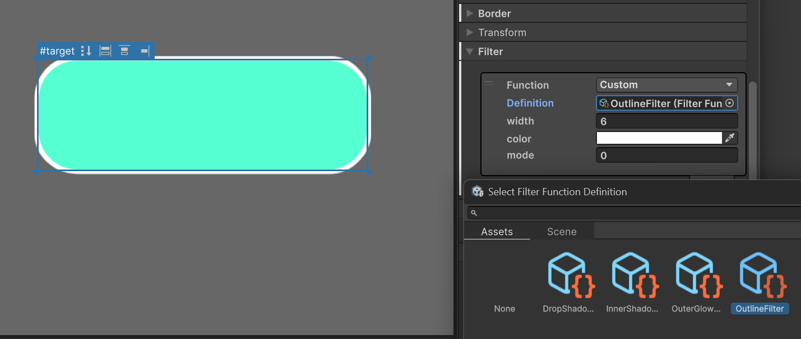
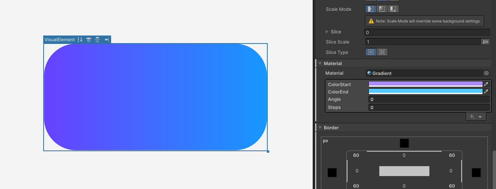

# UITK Effects

[](https://unity.com/releases/editor/archive)
[](https://docs.unity3d.com/Manual/upm-ui-giturl.html)
[](https://github.com/NK-Studio/com.nkstudio.uitk-effect/releases)
[](https://nk-studio.github.io/Packages/com.nkstudio.uitk-effects@1.0/manual/index.html)
[](https://nk-studio.github.io/Packages/com.nkstudio.uitk-effects@1.0/license/License.html)

UITK Effects는 에셋 기반으로 Unity UI Toolkit 시각 효과를 제공하는 Git UPM 패키지입니다. Drop Shadow, Inner Shadow, Outer Glow, Outline 필터와 그라디언트 머티리얼을 UI Builder에서 바로 사용할 수 있습니다.



## 특징

- `Label`, `Image`, 벡터 그래픽에 여러 개의 그림자를 중첩 적용할 수 있습니다.
- Outside, Center, Inside 정렬을 지원하는 아웃라인을 여러 개 중첩할 수 있습니다.
- 그림자, 글로우, 아웃라인 등 서로 다른 효과를 체인하여 복합 효과를 만들 수 있습니다.
- 색상, 각도, 단계 값을 조절할 수 있는 그라디언트 머티리얼을 제공합니다.
- 일반적인 사용에는 별도의 런타임 C# 코드가 필요하지 않습니다.
- UI Builder에서 설정하고 Canvas에서 결과를 바로 확인할 수 있습니다.

## 문서

설치 과정, 효과별 파라미터, 그라디언트 주의사항은 공식 문서에서 확인할 수 있습니다.

- [UITK Effects 공식 문서](https://nk-studio.github.io/Packages/com.nkstudio.uitk-effects@1.0/manual/index.html)
- [변경 내역](https://nk-studio.github.io/Packages/com.nkstudio.uitk-effects@1.0/changelog/CHANGELOG.html)
- [라이선스](https://nk-studio.github.io/Packages/com.nkstudio.uitk-effects@1.0/license/License.html)

## 요구사항

- Unity `6000.3.0f1` 이상
- UI Toolkit
- Git이 설치된 개발 환경

## 설치

Unity에서 **Window > Package Manager**를 열고 **+ > Install package from git URL...**을 선택한 다음 아래 URL을 입력합니다.

```text
https://github.com/NK-Studio/com.nkstudio.uitk-effect.git
```

### UI Builder 에셋 설치

필터 정의와 그라디언트 머티리얼은 패키지 설치 후 **UITK Effects Setup** 창을 통해 프로젝트의 `Assets/UITK Effects`로 복사할 수 있습니다. 이 과정을 거쳐야 UI Builder의 에셋 선택기에서 해당 에셋을 찾을 수 있습니다.

1. 패키지 임포트 후 자동으로 열리는 **UITK Effects Setup** 창을 확인합니다.
2. **Install UI Builder Assets** 버튼을 클릭합니다.
3. 각 항목의 상태가 **Installed**로 변경되었는지 확인합니다.

창이 자동으로 열리지 않으면 **Window > NK Studio > UITK Effects Setup**에서 다시 열 수 있습니다. **Show at Startup**을 끄면 다음 세션부터 자동으로 표시되지 않습니다.



## 시작하기

다음은 UI Builder에서 Outline 필터를 적용하는 기본 과정입니다.

1. `VisualElement`를 그리거나 아웃라인을 적용할 `Label`을 준비합니다.
2. 대상 요소를 선택하고 Inspector의 **Filter** 섹션으로 이동합니다.
3. **+** 버튼을 눌러 새 필터를 만들고 Function을 **Custom**으로 지정합니다.
4. **Definition**에서 `Outline Filter`를 선택합니다.
5. `width`, `color`, `mode` 값을 조절합니다.



| `mode` | 위치 | 설명 |
| --- | --- | --- |
| `0` | Outside | 요소의 바깥쪽으로 아웃라인을 그립니다. |
| `1` | Center | 요소의 경계를 중심으로 아웃라인을 그립니다. |
| `2` | Inside | 요소의 안쪽으로 아웃라인을 그립니다. |

## 포함된 효과

| 효과 | 유형 | 설명 |
| --- | --- | --- |
| Drop Shadow | Filter | 요소 바깥쪽에 하나 이상의 부드러운 그림자를 표현합니다. 오프셋, 블러, 색상을 조절할 수 있습니다. |
| Inner Shadow | Filter | 요소 안쪽 가장자리에 음영을 추가해 눌린 컨트롤이나 오목한 표면을 표현합니다. |
| Outer Glow | Filter | 요소 주변에 부드럽게 퍼지는 색상 글로우를 표현합니다. 반경과 강도를 조절할 수 있습니다. |
| Outline | Filter | 요소 형태를 따라 외곽선을 표현합니다. 두께, 색상, 정렬 방식을 조절할 수 있습니다. |
| Gradient | Material | 두 색상 사이의 부드러운 전환 또는 단계형 그라디언트를 표현합니다. |

모든 필터는 `Label`, `Image`, 벡터 그래픽에 적용할 수 있으며, 같은 필터를 여러 번 사용하거나 서로 다른 필터를 함께 체인할 수 있습니다.

## 그라디언트 머티리얼

Gradient는 필터가 아니라 `-unity-material`로 적용하는 커스텀 머티리얼입니다.



| 프로퍼티 | 설명 |
| --- | --- |
| `ColorStart` | 그라디언트 시작 색상 |
| `ColorEnd` | 그라디언트 끝 색상 |
| `Angle` | 그라디언트 각도. `0`은 왼쪽에서 오른쪽 방향입니다. |
| `Steps` | 색상 전환 단계. `150`에 가까울수록 부드럽게 이어집니다. |

### 주의사항

- 그라디언트는 요소의 배경 위에 색을 곱하므로 **Background Color를 불투명한 흰색**으로 지정해야 원래 색상이 표시됩니다.
- `-unity-material`은 자식에게 상속됩니다. 자식 `Label`이 보이지 않는 문제를 피하려면 상위 부모 아래에 그라디언트 요소와 `Label`을 서로 형제 요소로 배치하는 구성을 권장합니다.
- 그라디언트 요소의 Border가 의도대로 표시되지 않으면 Border 대신 Outline 필터를 사용하세요.

## 샘플

Setup Window의 샘플 영역은 현재 Unity 버전을 감지하여 호환되는 샘플을 권장합니다.

| Unity 버전 | 샘플 | 씬 구성 |
| --- | --- | --- |
| Unity 6.3 / 6.4 | `Filter Sample (Unity 6.3)` | `UIDocument` |
| Unity 6.5 이상 | `Filter Sample (Unity 6.5+)` | `PanelRenderer` |

**Import Recommended Sample** 버튼을 누르면 현재 에디터에 맞는 샘플만 가져옵니다. 두 샘플은 Package Manager의 **Samples** 목록에도 각각 노출되므로 필요한 버전을 직접 가져올 수도 있습니다.

각 샘플에는 그림자, 글로우, 아웃라인, 그라디언트가 조합된 UI와 실행 가능한 씬이 포함되어 있습니다. 두 씬은 자동 변환하지 않으며 각 Unity 버전에 맞는 컴포넌트 구성을 명시적으로 유지합니다.

## License

사용 조건은 [License](https://nk-studio.github.io/Packages/com.nkstudio.uitk-effects@1.0/license/License.html)를 확인하세요.
